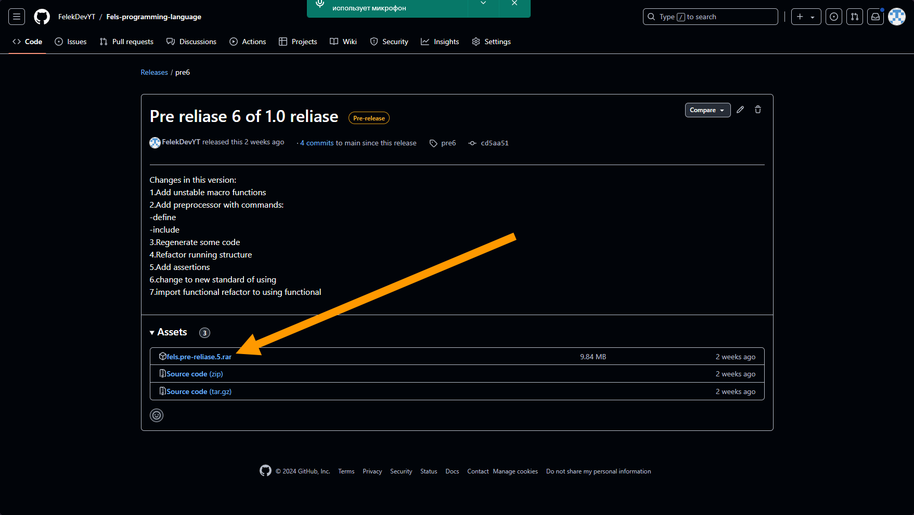
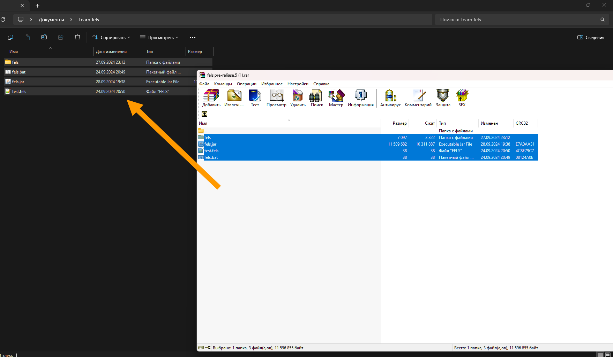
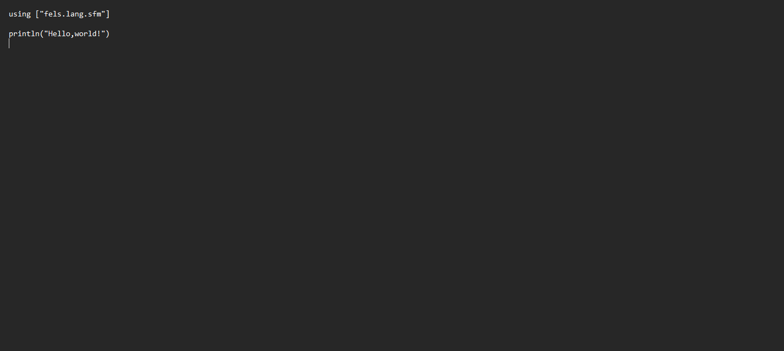
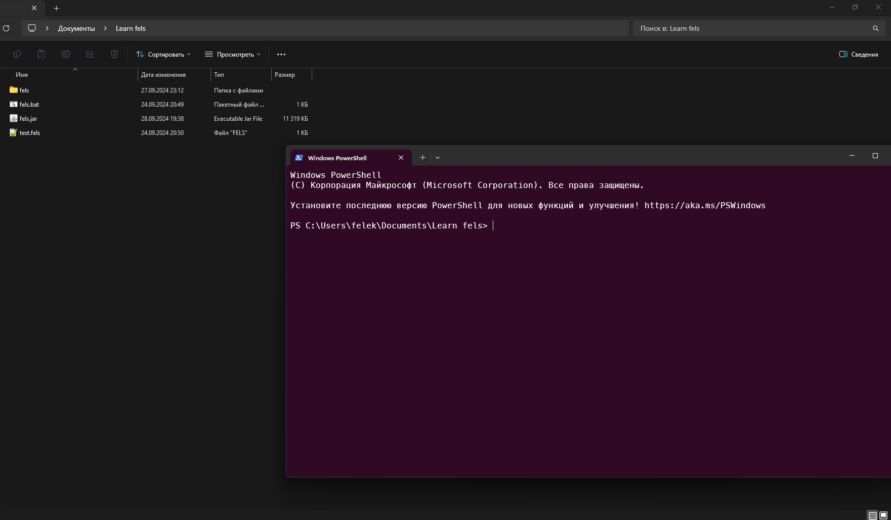
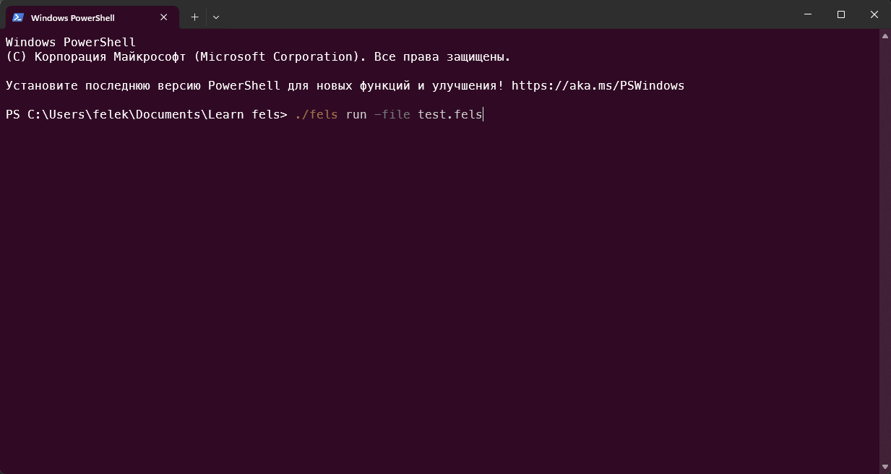
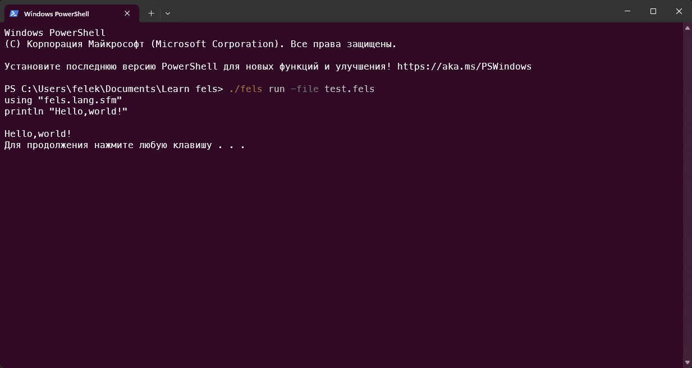
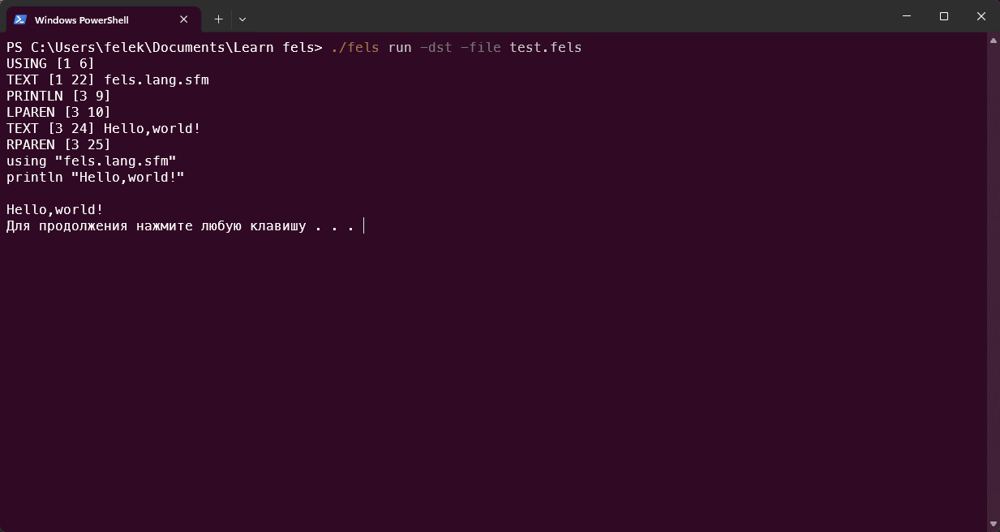
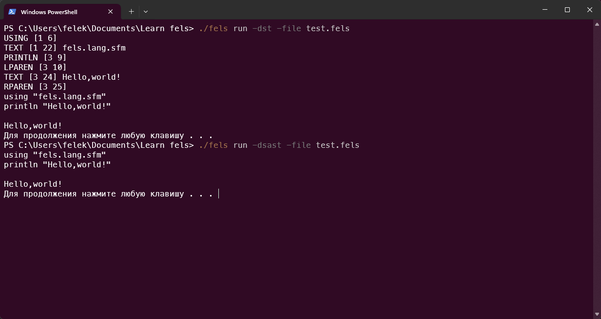
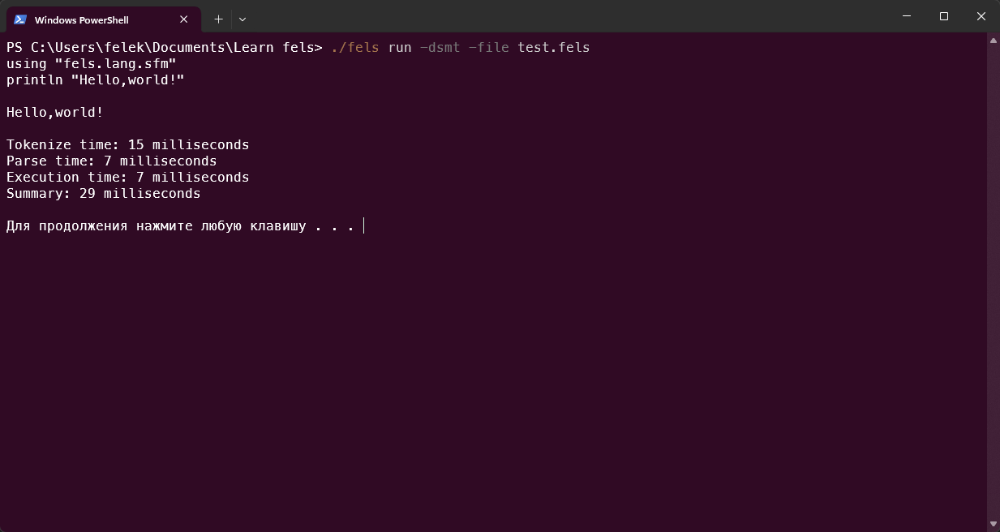
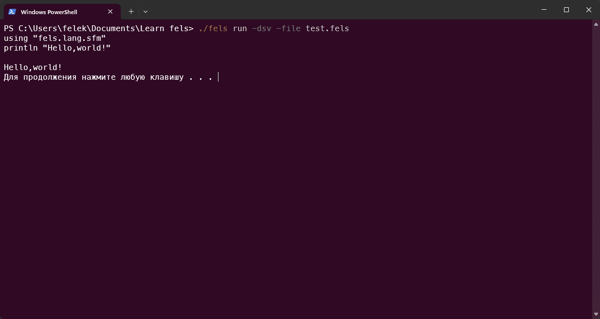

# Installing and running Fels

## Installing

1.[Download the last release](https://github.com/FelekDevYT/Fels-programming-language/releases/tag/pre7)


2.Unzip .rar archive to folder on you PC


3.Open test.fels file in text editor


4.Write to test.fels:
```
using "fels.lang.sfm"
println("Hello,world!")

```

5.run cmd on this folder


6.write to cmd: ```./fels run -file test.fels```


7.Press Enter key and get result of program


8.My congratulations, you are start you first program on Fels!

## Professional running guide

Behind read this part you should read basics of Fels [Read](lang.md)

## Running configurations

You can set run arguments by next steps:

1.Write tokens to console>>>```./fels run -dst -file test.fels```


2.Do Show AbstractSyntaxTree signature>>>```./fels run -dsast -file test.fels```


3.Do Show Measurement time>>>```./fels run -dsmt -file test.fels```


4.Do Show Variables(Visitor)>>>```./fels run -dsv -file test.fels```


5.Do Preprocess>>>```./fels run -dp -file test.fels```

